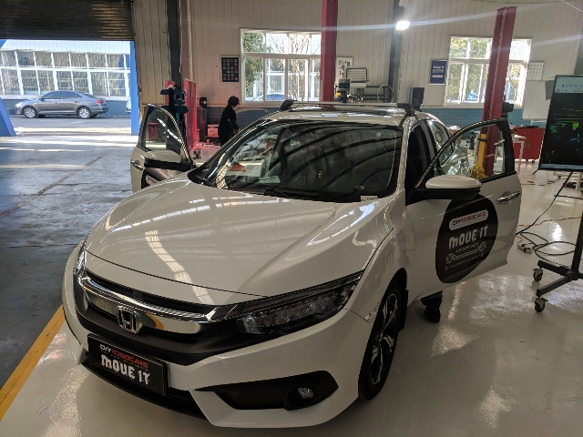
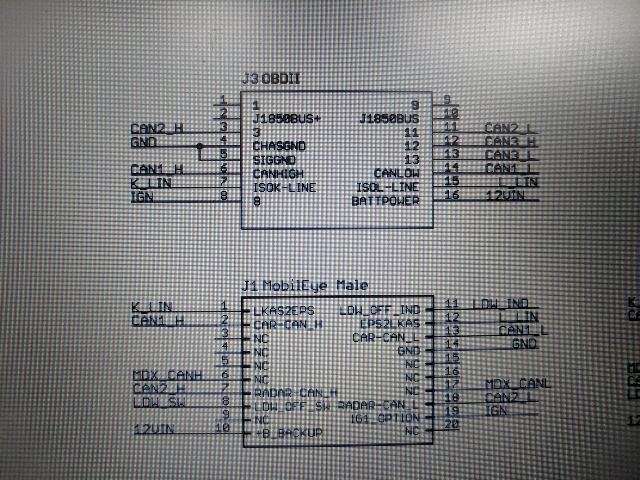
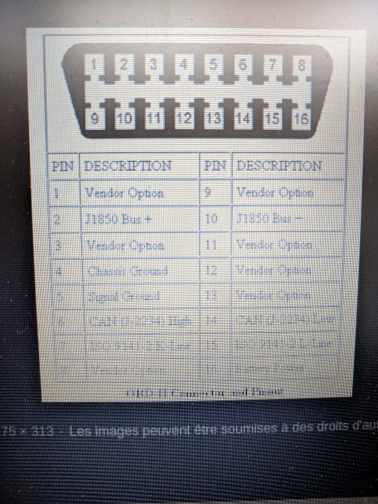
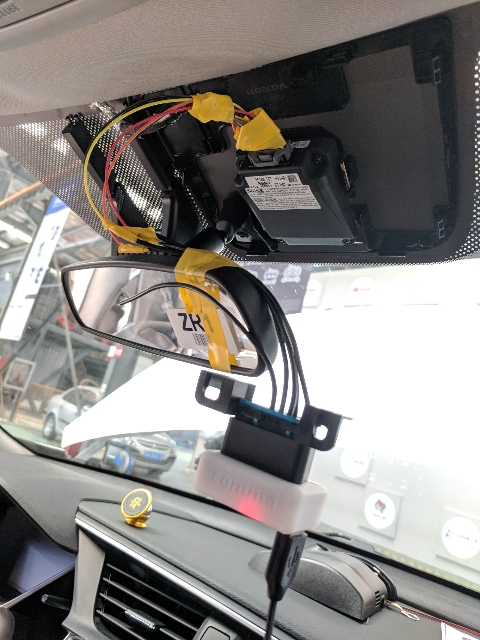

# Blog about how we got where we got

For the Honda Civic 2016 from the pixmoving moveit hackathon:



## Connect to the CAN bus

We needed to connect to one of the CAN buses (it has two). We made a connector to attach ourselves
to the camera thing.

Pinout of the connector of MobilEye:


Pinout of the ODB II connector:


Which the hacky setup of the panda board connected to the MobilEye connector in the car looks like:


We used a Pandacan board ([wiki](https://community.comma.ai/wiki/index.php/Panda#LED_Indicators), [github docs](https://github.com/commaai/panda), [how to get started](https://medium.com/@comma_ai/a-panda-and-a-cabana-how-to-get-started-car-hacking-with-comma-ai-b5e46fae8646)) to connect to the CAN bus and a laptop to it. 

It's extremely easy to use, just install `pip install pandacan` and you can be reading the CAN bus with:

```python
from panda import Panda
p = Panda()
data = p.can_recv()
# Up to 256 CAN messages
print(data)
# Looks like:
# [(420, 55639, bytearray(b'\x00f\x00\x00\x00\x00\x00:'), 0),
# (428, 55761, bytearray(b'\x7f\xff\x00\x00\x00\x08\x002'), 0),
# ... ]
```

Note that you may need to add [linux udev rules](https://community.comma.ai/wiki/index.php/Panda#Linux_udev_rules) to be able to run without root scripts that use Panda.


## Understand the CAN data

We looked at the [comma.ai openpilot]() project. There is useful code for many cars. We found difficult to compile the dependences so we extracted
the useful bits for us for our car.

That was getting a [DBC file]() with the CAN commands of the car. We needed to modify it slightly to be able to read the definition with the
[cantools]() library. Thanks a lot for the hard work of figuring it out and publishing it guys!


## Publish it in ROS


## Control the car


